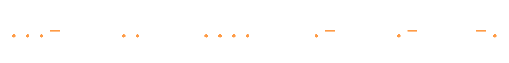

A Medical Student with a keen interest in Development, Open Access and Animation. I've also found an interest in Research, Evidence synthesis based Research methodology, Evidence synthesis and open-source Research Softwares.

🌐 I’m always open to collaboration, feedback and ideas - feel free to drop a line!
-  GitHub → [aurumz-rgb](https://github.com/aurumz-rgb)  
-  Email → [Mail](mailto:pteroisvolitans12@gmail.com)  
-  ResearchGate → [V.S.](https://www.researchgate.net/profile/Vihaan-Sahu)

---

##  Stats

  <table>
    <tr>
      <td width="50%">
        
      </td>
      <td width="50%">
        
      </td>
    </tr>
  </table>

